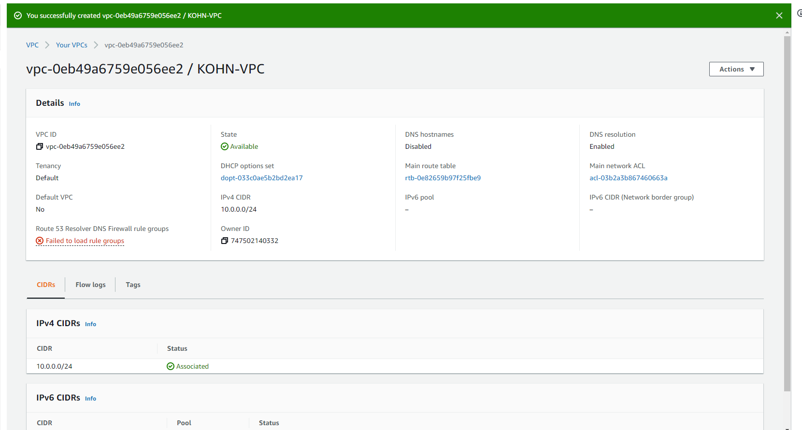
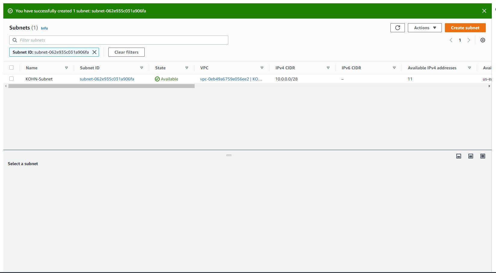
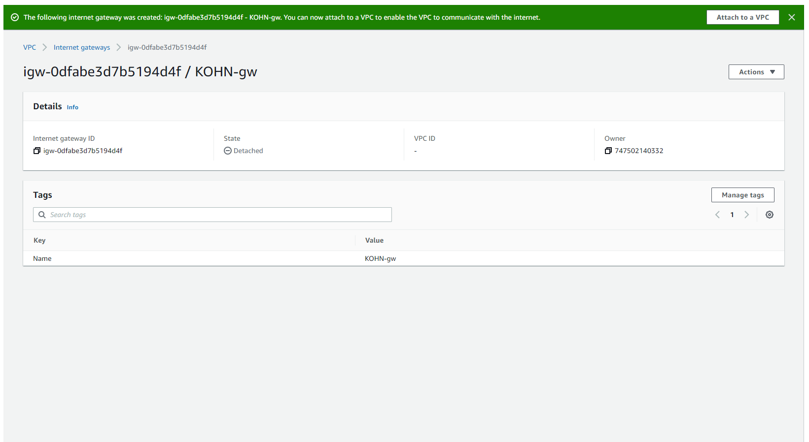
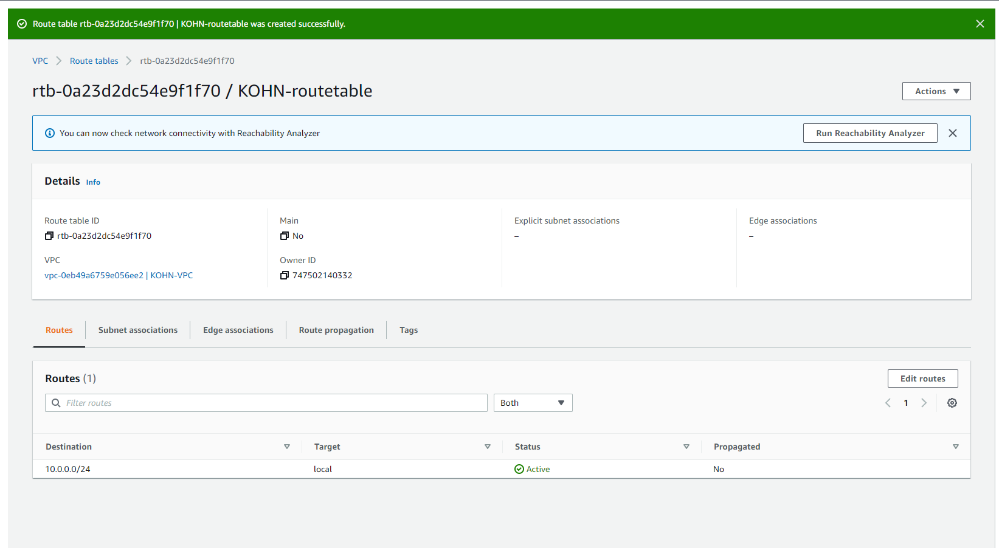
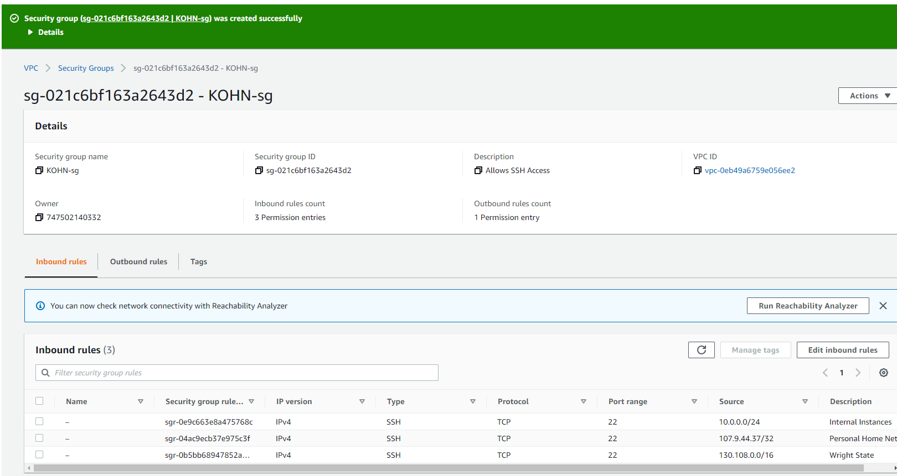
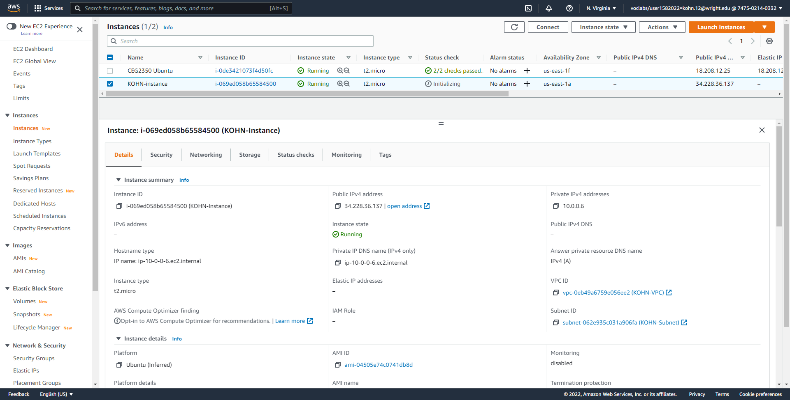
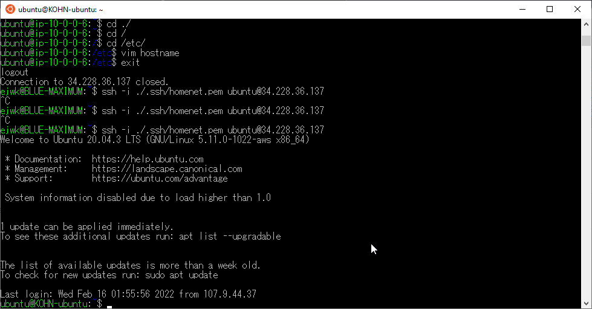

# Project 2
## Part 1

1. VPC created & configured & role described
  - Virtual Private Cloud, the framework for everything else described here to attach to. It ties everything together. Basically an unconfigured router by itself.
  
2. Subnet created & configured & role described
  - Creates a realm of IPs that instances in the VPC can hold.
  
3. Internet gateway created & configured & role described
  - Allows access for all the instances on the subnet to talk with each other and with the outside world
  
4. Route table created and configured & role described
  - Determines where network traffic is directed within the VPC.
  
5. Security group created and configured & role described
  - Allows for setting inbound and outbound rules. By default, permits nothing in or out. Needs to let us in to SSH!
  

## Part 2

1. Instance details
  - AMI selected: Ubuntu 20.04
    - default username of the instance type selected: ubuntu
  - Instance type selected: t2.micro
2. How to attach instance to VPC:
  - Configure instance details when creating instance and select the VPC
3. Public IP address auto-assign - yay or nay and why?
  - Nay
    - Elastic IPs cost money. I'm erring on the side of caution.
4. How to create and attach storage volume to instance
  - Configured when setting up instance after details, used a 
5. How to tag instance with "Name" of "YOURLASTNAME-instance"
  - Prompted to edit tags. Set a tag with "Name" and set the details to "YOURLASTNAME-instance".
  - Alternatively, use the edit button under the Name header in the instances menu afterwards.
6. How to associate VPC security group (your security group) with your instance
  - Use an existing security group and tie the instance to the one previously created above.
7. How to create / reserve and associate and Elastic IP address with your instance
  - Go to Elastic IPs menu
  - Allocate an Elastic IP
    - Pick network border group (default is probably fine)
    - Add a name tag and select the pool to pull from
    - Allocate!
  - Associate the IP Address
    - Pick the instance to tie it to
    - Select the private IP address that is available
    - Associate!
8. Screenshot with instance details
  
9. How to change hostname via commands on instance
  - `sudo hostnamectl set-hostname KOHN-ubuntu`
10. Screenshot of successful SSH connection to instance (with your new hostname instead of ip-##-##-##-##)
  
