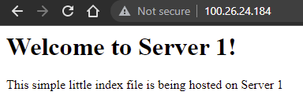
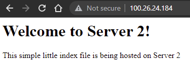

## Part 2 - Setup Load Balancing TODOs

1. Create an `/etc/hosts` OR `.ssh/config` file on each system that correlates hostnames to private IPs.
   - Description of how file is configured
     - Give it a name under 'host'
	 - HostName set to the private IP on the AWS network
	 - User set to ubuntu
	 - Port set to 22
	 - Set IdentityFile to path to the private key
	 - Make sure private key is chmod 600
2. Document how to SSH in between the systems utilizing their private IPs.
     - Use command `ssh` followed by the name given in the config: `proxy`, `webserv1`, or `webserv2`
3. **_HAProxy configuration & documentation requirements_**
   - How to set up a HAProxy load balancer
     - What file(s) where modified & their location
	   - /etc/haproxy/**haproxy.cfg**
     - What configuration(s) were set (if any)
	   - Removed some default settings that are irrelevant to our systems
	   - Added frontend and backend, listing the tying the public ip and ports and backend web servers together
     - How to restart the service after a configuration change
	   - Go into AWS, select the instance and select Reboot Instance under Instance State.
     - Resources used (websites)
	   - [HAProxy website](https://www.haproxy.com/blog/the-four-essential-sections-of-an-haproxy-configuration/)
4. **_Webserver 1 & 2 configuration & documentation requirements_**
   - How set up a webserver
     - What file(s) were modified & their location
	   - /var/www/html/**index.html**
     - What configuration(s) were set (if any)
	   - None required for basic functionality
     - Where site content files were located (and why)
	   - /var/www primarily because this is what ubuntu permits access to through web browsers by default
     - How to restart the service after a configuration change
	   - `sudo systemctl restart apache2`
     - Resources used (websites)
	   - apache2's default index.html for setup directions
5. From the browser, when connecting to the proxy server, take two screenshots.
   - 
   - 
6. (Optional) - link to your proxy so I can click it.
   - [Link!](http://100.26.24.184/)